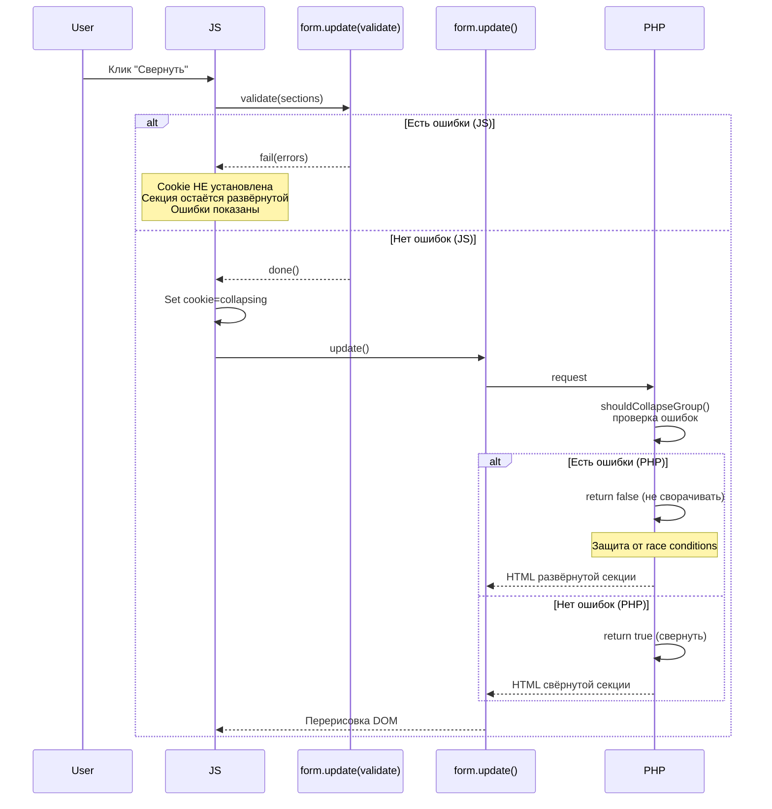

# Концепция: Zen Mode (Дзен-режим корзины)

> **Нейминг:** Используем **"Дзен-режим"** в UI и **"zen"** в коде.
>
> Почему "Дзен"? Это не просто "сделали меньше" — это про:
>
> - ☮️ **Спокойствие** — не путаем пользователя полями
> - 🎯 **Фокус** — только важное (кнопка "Оформить")
> - ⚡ **Скорость** — не нужно скроллить через 20 полей

---

## Глоссарий

| Термин     | Описание                                                      | Примеры                                                       |
| ---------- | ------------------------------------------------------------- | ------------------------------------------------------------- |
| **Группа** | Логическое объединение секций (используется в коде и cookies) | `customer`, `delivery`, `payment`                             |
| **Секция** | HTML-блок в чекауте Shop-Script                               | `auth`, `region`, `shipping`, `details`, `payment`, `confirm` |
| **Хук**    | PHP-точка расширения для вставки контента в секцию            | `checkout_render_auth`, `checkout_render_region`              |

---

## Проблема

В корзине Shop-Script много полей для заполнения. Когда поля уже предзаполнены плагином Prefill, показывать их все пользователю избыточно — это создаёт визуальный шум и может "напугать" пользователя обилием форм.

**Цель:** Свернуть секции с предзаполненными данными, показывая только краткую сводку информации.

---

## Решения принятые

| Вопрос                    | Решение                                                                     |
| ------------------------- | --------------------------------------------------------------------------- |
| Для кого сворачивать?     | Для **всех** — и авторизованных, и гостей                                   |
| Как разворачивать?        | Кнопка/ссылка **"Изменить"** в низу секции через последний хук группы       |
| Кнопка "Развернуть всё"?  | Пока не нужна в UI, но **функционал нужен** (для разворота при ошибках)     |
| Когда сворачивать?        | Если в чекауте **нет ошибок валидации** — сворачиваем все включенные секции |
| Кастомные поля (details)? | Уже реализовано в основном prefill — переиспользуем                         |
| Header секций?            | **НЕ трогаем** — оставляем стандартный header Shop-Script                   |

---

## Архитектура групп ✅

Секции объединяются в **4 логические группы**:

```
┌─────────────────────────────────────────────────────────────────┐
│ [icon] ПОКУПАТЕЛЬ (группа: customer, секция: auth)           │
│        Данные покупателя: имя, телефон, email, компания       │
├─────────────────────────────────────────────────────────────────┤
│ [icon] ДОСТАВКА (группа: delivery)                               │
│        Секции: region + shipping + details                       │
├─────────────────────────────────────────────────────────────────┤
│ [icon] ОПЛАТА (группа: payment, секция: payment)                │
│        Способ оплаты с кастомными полями                        │
├─────────────────────────────────────────────────────────────────┤
│ [icon] ПОДТВЕРЖДЕНИЕ (секция: confirm)                         │
│        Итого, условия, кнопка — НЕ СВОРАЧИВАЕТСЯ                  │
└─────────────────────────────────────────────────────────────────┘
```

### Группы и секции

| Группа (ID в коде) | Секции чекаута                  | Хуки для кнопок                                 | Сворачивать? |
| ------------------ | ------------------------------- | ----------------------------------------------- | ------------ |
| `customer`         | `auth`                          | `checkout_render_auth` (в конце)                | ✅ Да        |
| `delivery`         | `region`, `shipping`, `details` | последний хук группы (`details` или `shipping`) | ✅ Да        |
| `payment`          | `payment`                       | `checkout_render_payment` (в конце)             | ✅ Да        |
| —                  | `confirm`                       | —                                               | ❌ Нет\*     |

> \*Секция `confirm` содержит итоговую стоимость, галочку условий и кнопку "Оформить заказ" — её **не нужно сворачивать**.

> [!NOTE]
> **Секция `details` может быть пустой или не рендериться** — если доставка отключена (`shipping.used = false`) или нет адресных полей для выбранной доставки. **Хук `checkout_render_details` может не вызываться!** Поэтому кнопку для группы delivery размещаем в последнем существующем хуке: если `details` не пустой → в `checkout_render_details`, иначе → в `checkout_render_shipping`.

### Поведение групп

1. **Клик «Изменить» на группе Доставка** → разворачиваются ВСЕ 3 секции (region, shipping, details)
2. **Сводка группы** — объединяет данные из всех секций группы
3. **Кнопки «Изменить»/«Свернуть»** — размещаются в **конце последней секции группы** через хуки body

**Вывод:** Кнопки управления размещаются в конце секции через хуки. Группировка — логическая (через cookie). Header секций остается стандартным от Shop-Script.

---

## Механизм сворачивания (CSS через PHP-хук) ✅

> **Ключевое решение:** CSS-скрытие вставляется через PHP-хук при каждом рендере формы, а не через JS-классы. Это решает проблему синхронизации с AJAX-обновлениями Shop-Script.

### Почему PHP-хук лучше JS-классов?

| Проблема                | JS-классы                                | PHP-хук                              |
| ----------------------- | ---------------------------------------- | ------------------------------------ |
| AJAX перерисовал секцию | ❌ Класс потерян, нужен MutationObserver | ✅ Хук сработал снова, CSS вставился |
| FOUC при загрузке       | ❌ Мелькание контента                    | ✅ CSS уже в HTML                    |
| Сложность               | Средняя                                  | Низкая                               |

### Архитектура хуков ✅

> [!IMPORTANT]
> **Один `<style>` тег на ВСЕ группы** — вставляется в последнем хуке (`checkout_render_confirm`).
> **Сводка и кнопка** — в последнем хуке каждой группы (auth для customer, details/shipping для delivery, payment для payment).

| Хук                        | Что вставляем                                        |
| -------------------------- | ---------------------------------------------------- |
| `checkout_render_auth`     | JavaScript Zen Mode + сводка/кнопка customer         |
| `checkout_render_shipping` | Сводка/кнопка delivery (если details пустой или нет) |
| `checkout_render_details`  | Сводка/кнопка delivery (если details существует)     |
| `checkout_render_payment`  | Сводка/кнопка payment                                |
| `checkout_render_confirm`  | `<style>` для ВСЕХ групп (генерируется последним)    |

**Преимущества:**

- Один `<style>` тег — меньше DOM-элементов
- CSS генерируется последним — гарантия наличия всех данных об ошибках
- Кнопки в конце секций — логичное расположение для действия "свернуть/развернуть"
- Не конфликтуем со стандартным header Shop-Script
- Нет дублирования CSS при AJAX-обновлениях

### Структура секции (реальная)

> [!IMPORTANT]
> **Хук плагина находится ВНУТРИ `wa-section-body`!** Это ключевой момент для понимания механизма скрытия.

```html
<section class="wa-step-section wa-step-auth-section">
  <header class="wa-section-header">
    <!-- Скрываем стандартный заголовок -->
    <h3 class="wa-header">Покупатель:</h3>
    <span class="wa-contact-name">Иван Иванов</span>
    <a href="?logout">Выход</a>
  </header>
  <div class="wa-section-body">
    <!-- Скрываем ДЕТЕЙ, кроме wa-plugin-hook -->
    <form>
      <!-- Поля формы (скрываются) -->
      <div class="wa-line wa-fields-group">...</div>

      <!-- Хук плагина ВНУТРИ формы! (остаётся видимым) -->
      <div class="wa-plugin-hook">
        <!-- Наша сводка и кнопка "Изменить" -->
      </div>
    </form>
  </div>
</section>
```

### CSS-механизм сворачивания

**Принцип:** Скрываем все элементы формы в `.wa-section-body`, **кроме** `wa-plugin-hook`. Стандартный header остается видимым.

```html
<!-- ОДИН style-тег для ВСЕХ групп (вставляется в checkout_render_auth) -->
<style id="prefill-zen-styles">
  /* === ГРУППА: Покупатель (auth) === */
  /* Скрываем всё в форме, кроме хуков плагинов */
  .wa-step-auth-section .wa-section-body form > *:not(.wa-plugin-hook) {
    display: none !important;
  }

  /* === ГРУППА: Доставка (region, shipping, details) === */
  .wa-step-region-section .wa-section-body form > *:not(.wa-plugin-hook) {
    display: none !important;
  }
  .wa-step-shipping-section .wa-section-body form > *:not(.wa-plugin-hook) {
    display: none !important;
  }
  .wa-step-details-section .wa-section-body form > *:not(.wa-plugin-hook) {
    display: none !important;
  }

  /* === ГРУППА: Оплата (payment) === */
  .wa-step-payment-section .wa-section-body form > *:not(.wa-plugin-hook) {
    display: none !important;
  }
</style>
```

> [!NOTE]
> **Почему `:not(.wa-plugin-hook)`?** Это сохраняет видимость хуков ВСЕХ плагинов в секции. Если есть другие плагины — их контент тоже останется видимым, что правильно: мы не знаем заранее, что они выводят.

### Принцип работы

```
┌─────────────────────────────────────────────────────────────────┐
│  PHP-хук checkout_render_auth (ПЕРВЫЙ хук чекаута)              │
│  ┌──────────────────────────────────────────────────────────┐  │
│  │  // 1. Добавляем JavaScript Zen Mode                     │  │
│  │  echo $this->generateJavaScript();                       │  │
│  │                                                          │  │
│  │  // 2. Выводим сводку/кнопку для customer в конце        │  │
│  │  echo $this->renderCollapseBlock('customer', $params);   │  │
│  └──────────────────────────────────────────────────────────┘  │
├─────────────────────────────────────────────────────────────────┤
│  PHP-хук checkout_render_shipping (проверяем details)           │
│  ┌──────────────────────────────────────────────────────────┐  │
│  │  // Если details пустой или не будет → выводим здесь     │  │
│  │  if (!hasDetails()) {                                    │  │
│  │      echo $this->renderCollapseBlock('delivery', ...);   │  │
│  │  }                                                       │  │
│  └──────────────────────────────────────────────────────────┘  │
├─────────────────────────────────────────────────────────────────┤
│  PHP-хук checkout_render_details (последний для delivery)       │
│  ┌──────────────────────────────────────────────────────────┐  │
│  │  // Если details существует → выводим здесь              │  │
│  │  echo $this->renderCollapseBlock('delivery', $params);   │  │
│  └──────────────────────────────────────────────────────────┘  │
├─────────────────────────────────────────────────────────────────┤
│  PHP-хук checkout_render_payment                                │
│  ┌──────────────────────────────────────────────────────────┐  │
│  │  // Выводим сводку/кнопку для payment                    │  │
│  │  echo $this->renderCollapseBlock('payment', $params);    │  │
│  └──────────────────────────────────────────────────────────┘  │
├─────────────────────────────────────────────────────────────────┤
│  PHP-хук checkout_render_confirm (ПОСЛЕДНИЙ хук чекаута)        │
│  ┌──────────────────────────────────────────────────────────┐  │
│  │  // 1. Собираем CSS для ВСЕХ групп                       │  │
│  │  $styles = [];                                           │  │
│  │  if ($this->shouldCollapseGroup('customer', $params)) {  │  │
│  │      $styles[] = '.wa-step-auth-section ...';            │  │
│  │  }                                                       │  │
│  │  if ($this->shouldCollapseGroup('delivery', $params)) {  │  │
│  │      $styles[] = '.wa-step-region-section ...';          │  │
│  │      $styles[] = '.wa-step-shipping-section ...';        │  │
│  │      $styles[] = '.wa-step-details-section ...';         │  │
│  │  }                                                       │  │
│  │  if ($this->shouldCollapseGroup('payment', $params)) {   │  │
│  │      $styles[] = '.wa-step-payment-section ...';         │  │
│  │  }                                                       │  │
│  │                                                          │  │
│  │  // 2. Выводим ОДИН style-тег                            │  │
│  │  echo '<style id="prefill-zen-styles">'                  │  │
│  │       . implode("\n", $styles) . '</style>';             │  │
│  │                                                          │  │
│  │  // ВАЖНО: CSS генерируется здесь, а не в auth,          │  │
│  │  // потому что здесь уже точно есть все данные об        │  │
│  │  // ошибках валидации для всех секций                    │  │
│  └──────────────────────────────────────────────────────────┘  │
└─────────────────────────────────────────────────────────────────┘
```

### Хранение состояния (Session Cookies)

Используем **session cookies** для хранения состояния развёрнутых секций:

```javascript
// Имена cookies
const COOKIES = {
  customer: "prefill_zen_customer",
  delivery: "prefill_zen_delivery",
  payment: "prefill_zen_payment",
};
```

**Важные свойства cookies:**

- **Session cookie** — без `expires`, удаляется при закрытии браузера
- **path=/** — доступна на всём сайте
- **SameSite=Lax** — безопасность

### JavaScript: Разворачивание секции

> [!NOTE]
> **Гонки состояний нет.** Cookie устанавливается **синхронно** до отправки AJAX-запроса. Браузер автоматически отправляет все cookies с каждым запросом, поэтому PHP-хук гарантированно получит cookie.

```javascript
// Клик на "Изменить" → установить cookie и перезагрузить форму
document.querySelector(".prefill-zen-expand-customer").addEventListener("click", function (e) {
  e.preventDefault();

  // 1. Cookie устанавливается СИНХРОННО (до AJAX)
  document.cookie = "prefill_zen_customer=expanded; path=/; SameSite=Lax";

  // 2. AJAX-запрос отправляется с этой cookie
  window.waOrder.form.reload();
});
```

#### UX-улучшение: защита от двойного клика (Phase 3)

```javascript
// Улучшенная версия с визуальным фидбеком
document.querySelector(".prefill-zen-expand-customer").addEventListener("click", async function (e) {
  e.preventDefault();

  // Защита от повторного клика (UX, не баг-фикс)
  if (this.disabled) return;
  this.disabled = true;
  this.textContent = "Загрузка...";

  document.cookie = "prefill_zen_customer=expanded; path=/; SameSite=Lax";

  await window.waOrder.form.reload();
  // После reload кнопка уже удалена из DOM (новый HTML)
});
```

### JavaScript: Умное сворачивание (Smart Collapse)

> [!IMPORTANT]
> **Изменение поведения:** Кнопка "Свернуть" теперь не просто удаляет куку, а инициирует проверку валидации на сервере.

**Алгоритм:**

1.  **Клик "Свернуть"** → JS устанавливает куку `prefill_zen_{group}=collapsing` (промежуточный статус).
2.  **Перезагрузка формы** → `window.waOrder.form.reload()`.
3.  **PHP-проверка (ZenHelper)**:
    - Видит статус `collapsing`.
    - Запускает валидацию (`extractCheckoutErrors`).
    - **Если есть ошибки**:
      - Вставляет JS-скрипт `alert('Пожалуйста, исправьте ошибки перед сворачиванием.')`.
      - Сбрасывает статус визуально на **Развёрнуто** (и куку на `expanded`).
      - Пользователь видит ошибки и остается в развёрнутой секции.
    - **Если нет ошибок**:
      - Сбрасывает куку (удаляет её или ставит пустой).
      - Рендерит секцию **Свёрнутой**.

```javascript
// Клик на "Свернуть" → переходим в режим проверки (collapsing)
document.querySelector(".prefill-zen-collapse-delivery").addEventListener("click", function (e) {
  e.preventDefault();

  // 1. Устанавливаем статус "попытка свернуть"
  document.cookie = "prefill_zen_delivery=collapsing; path=/; SameSite=Lax";

  // 2. Перезагружаем форму для валидации на сервере
  window.waOrder.form.reload();
});
```

> **Диалог ошибки:** Для начала используем стандартный `alert()`. В будущем можно заменить на красивый `wa-dialog` или кастомный модал.

### JavaScript: Валидация при сворачивании

> [!IMPORTANT]
> **Изменение 2026-02-15:** Реализована JS-валидация с двойной защитой. Кнопка "Свернуть" теперь **всегда видна** в развёрнутой секции.

### JavaScript: Валидация при сворачивании с двойной защитой

**Архитектура:**

- **JS-валидация** (UX) — проверяет перед установкой cookie, показывает ошибки сразу
- **PHP-валидация** (безопасность) — проверяет при рендере, защита от race conditions

**Решение:**

```javascript
// Встроено в generateJavaScript() - не требует отдельного модуля
document.addEventListener('click', function(e) {
    var btn = e.target.closest('.js-prefill-zen-toggle');
    if (!btn) return;
    
    var group = btn.dataset.group;
    var action = btn.dataset.action;
    
    if (action === 'collapse') {
        var sections = getSectionsForGroup(group);
        
        // 1. JS-валидация группы секций
        window.waOrder.form.update({
            render_errors: true,
            sections: sections
        }).done(function() {
            // 2. Нет ошибок → устанавливаем cookie
            document.cookie = 'prefill_zen_' + group + '=collapsing; path=/; SameSite=Lax';
            
            // 3. Обновляем форму → PHP отрендерит свёрнутую секцию
            // PHP повторно проверит ошибки (защита от race conditions)
            window.waOrder.form.update();
        });
        // .fail() обрабатывать не нужно — ошибки уже показаны
    }
});
```

**Преимущества:**

- Валидация на клиенте перед установкой cookie (UX)
- PHP повторно проверяет при рендере (безопасность)
- Кнопка "Свернуть" всегда видна → лучший UX
- Защита от race conditions между запросами

**Почему двойная проверка?**

JS может проверить → ошибок нет → установить cookie → но между запросами данные изменились → PHP проверяет заново при рендере.

**Цепочка валидации при submit:**

```
Submit → update() → getFormData() → секции.getData() → проверка доставки/оплаты
```

**Почему form.update():**

- Выполняет полную валидацию всех секций через `getFormData()`
- Проверяет shipping type/variant в `Shipping.getData()`
- Проверяет payment method в `Payment.getData()`
- Показывает ошибки визуально через `render_errors: true`
- Возвращает Promise с ошибками в `.fail()`

### Поток сворачивания с JS-валидацией



### Размещение кнопок в конце секции

> [!IMPORTANT]
> **Изменение 2026-02-15:** Кнопка "Свернуть" теперь **всегда видна** в развёрнутой секции, независимо от ошибок.

**Кнопки «Изменить» и «Свернуть» размещаются в конце секции через хуки**, а не в header. Это логичное расположение для действия "свернуть/развернуть" и не требует манипуляций со стандартным header Shop-Script.

**Принцип:**

- Стандартный `.wa-section-header` остается без изменений
- В конце секции через хук выводится `.prefill-zen-collapse-block` с кнопкой и сводкой
- Кнопка меняет текст в зависимости от состояния (свёрнуто/развёрнуто)

| Состояние  | Что показывает блок управления    |
| ---------- | --------------------------------- |
| Свёрнуто   | Сводка данных + кнопка «Изменить» |
| Развёрнуто | Кнопка «Свернуть» (всегда)        |

### Поведение сводки

```
┌─────────────────────────────────────────────────────────────────┐
│  СВЁРНУТО (cookie нет или данные валидны)                       │
│  ┌─────────────────────────────────────────────────────────┐    │
│  │ 🚚 Доставка                                             │ ← стандартный .wa-section-header
│  └─────────────────────────────────────────────────────────┘    │
│  ← .wa-section-body СКРЫТ (кроме wa-plugin-hook)                │
│  ┌─────────────────────────────────────────────────────────┐    │
│  │ СДЭК Курьер • 350 ₽ • ул. Ленина, 15                    │ ← prefill-zen-summary
│  │                                        [Изменить ▼]      │ ← prefill-zen-btn
│  └─────────────────────────────────────────────────────────┘    │
├─────────────────────────────────────────────────────────────────┤
│  РАЗВЁРНУТО (cookie = expanded)                                 │
│  ┌─────────────────────────────────────────────────────────┐    │
│  │ 🚚 Доставка                                             │ ← стандартный .wa-section-header
│  └─────────────────────────────────────────────────────────┘    │
│  ┌─────────────────────────────────────────────────────────┐    │
│  │ Регион: [Новосибирск        ▼]                          │    │
│  │ Способ: ○ СДЭК ○ Почта ○ Самовывоз                      │    │
│  │ Адрес:  [ул. Ленина, д. 15    ]                         │    │
│  └─────────────────────────────────────────────────────────┘    │
│  ← .wa-section-body ВИДЕН                                       │
│  ┌─────────────────────────────────────────────────────────┐    │
│  │                                        [Свернуть ▲]      │ ← prefill-zen-btn
│  └─────────────────────────────────────────────────────────┘    │
└─────────────────────────────────────────────────────────────────┘
```

> **Важно:** При развёрнутой группе сводка скрывается, показывается только кнопка «Свернуть».

### Очистка после создания заказа (PHP-хук)

> Используем PHP-хук `orderActionCreate` — **надёжнее**, чем JS-событие.

```php
/**
 * Хук: очистка cookies zen-режима после создания заказа
 */
public function orderActionCreate($params)
{
    // Удаляем все cookies дзен-режима
    $cookies = ['prefill_zen_customer', 'prefill_zen_delivery', 'prefill_zen_payment'];

    foreach ($cookies as $name) {
        wa()->getResponse()->setCookie($name, '', -1, '/');
    }
}
```

**Почему PHP лучше JS:**

- Работает даже если JS отключён
- Не зависит от событий браузера
- Гарантированно выполняется на сервере

### PHP: Проверка состояния в хуке

```php
// В методе хука checkoutRenderAuth()
public function checkoutRenderAuth($params)
{
    $zen_settings = $this->getSettings('zen');

    // Проверяем: включен ли дзен-режим и не развёрнута ли секция
    $is_expanded = waRequest::cookie('prefill_zen_customer') === 'expanded';

    if ($zen_settings['active'] && $zen_settings['groups']['customer']['enabled'] && !$is_expanded) {
        // Секция должна быть свёрнута
        return $this->renderZenCollapsed('customer', $params);
    }

    // Секция развёрнута — не добавляем CSS скрытия
    return '';
}
```

### Кастомные заголовки секций

**Проблема:** Стандартные заголовки Shop-Script содержат лишнюю информацию:

- `Покупатель: Иван Иванов [Выход]` — дублирует сводку
- `Регион` — просто текст без кнопки редактирования

**Решение:** Скрываем стандартные заголовки и рисуем свои с кнопкой управления.

#### Что скрывается CSS

Для **всех** сворачиваемых секций:

```css
.wa-step-{section}-section .wa-section-header { display: none !important; }
```

#### Свёрнутое состояние (кнопка «Изменить»)

```html
<div class="prefill-zen-collapse-block">
  <div class="prefill-zen-summary">{$summary_html}</div>
  <a href="#" class="prefill-zen-btn js-prefill-zen-toggle" data-group="{$group}" data-action="expand">Изменить ▼</a>
</div>
```

#### Развёрнутое состояние (кнопка «Свернуть»)

```html
<div class="prefill-zen-collapse-block">
  <a href="#" class="prefill-zen-btn js-prefill-zen-toggle" data-group="{$group}" data-action="collapse">Свернуть ▲</a>
</div>
<!-- Сводка НЕ выводится -->
```

### Общая деактивация дзен-режима

Администратор может полностью отключить дзен-режим для всех пользователей:

- **Где:** Настройки плагина → Вкладка "Дзен-режим" → Чекбокс "Включить Дзен-режим"
- **Эффект:** При отключении PHP-хук не выводит CSS скрытия, все секции остаются развёрнутыми
- **Настройка `zen.active`:** `false` (по умолчанию выключен)

> **Примечание:** Деактивация дзен-режима не влияет на само предзаполнение данных — только на их визуальное отображение.

---

## Сводка данных по секции

> **Анализ маркетплейсов:** Изучены Wildberries, Ozon, Яндекс Маркет.
> Основные принципы: показывать минимум важной информации, телефон важнее email'а.

### Шаблоны по умолчанию

#### 1. Секция auth (Покупатель)

**Для физлица:**

```
{firstname} {lastname} • {phone}
```

Пример: `Артём Шамбергер • +7 923 705-63-78`

**Для компании:**

```
{company} • {firstname} {lastname} • {phone}
```

Пример: `ООО "Ромашка" • Иван Петров • +7 999 123-45-67`

> **Почему без email?** На маркетплейсах email не показывают в сводке — телефон важнее для связи. Email можно добавить как опцию.

---

#### 2. Секция region (Регион)

```
{city}, {region}
```

Пример: `Новосибирск, Новосибирская область`

> **Примечание:** Эту секцию часто объединяют с доставкой. Можно скрывать если город указан в доставке.

---

#### 3. Секция shipping (Доставка)

**Курьер (todoor):**

```
{shipping_name} • {shipping_rate}
{street}, д. {building}{if apartment}, кв. {apartment}{/if}
{shipping_date}
```

Пример:

```
СДЭК Курьер • 350 ₽
ул. Ленина, д. 15, кв. 42
Доставим 30 января
```

**Пункт выдачи (pickup):**

```
{shipping_name} • {shipping_rate}
{possible_address}
Срок хранения {storage_days} дней • {shipping_date}
```

Пример:

```
В пункт выдачи • Бесплатно
Новосибирск, Большевистская Улица 108, (Пункт выдачи)
Срок хранения 14 дней • 30 января
```

**Почта (post):**

```
{shipping_name} • {shipping_rate}
{zip}, {city}, {street}, д. {building}
{shipping_date}
```

> **Важно:** Wildberries и Ozon делают акцент на дате доставки и стоимости (бесплатно).

---

#### 4. Секция details (Дополнительно)

```
{street}, д. {building}{if apartment}, кв. {apartment}{/if}
```

Пример: `ул. Ленина, д. 15, кв. 42`

> **Примечание:** Если есть кастомные поля — добавлять их через `{custom.field_id}`.

---

#### 5. Секция payment (Оплата)

```
{payment_name}
```

Пример: `Банковская карта`

**С бонусом (если есть):**

```
{payment_name} • {payment_bonus}
```

Пример: `WB Кошелёк: 59 ₽ (-3%)`

---

### Таблица шаблонов по умолчанию (ГРУППЫ)

> **Примечание:** Таблица показывает упрощённый вид. Реальные шаблоны в настройках содержат условия Smarty (`{if}...{/if}`) для обработки необязательных полей.

| Группа       | Тип             | Шаблон                                             | Пример                          |
| ------------ | --------------- | -------------------------------------------------- | ------------------------------- |
| **customer** | —               | `{firstname} {lastname} • {phone}`                 | Артём Ш. • +7 923 705-63-78     |
| **delivery** | default         | `{shipping_name} • {shipping_rate}\n{city}`        | СДЭК • 350 ₽\nНовосибирск       |
| **delivery** | todoor (курьер) | `{shipping_name} • {shipping_rate}\n{street}`      | Курьер • 350 ₽\nул. Ленина, 15  |
| **delivery** | pickup (ПВЗ)    | `{shipping_name} • {shipping_rate}\n{pvz_name}`    | ПВЗ • Бесплатно\nСДЭК Ленина 15 |
| **delivery** | post (почта)    | `{shipping_name} • {shipping_rate}\n{zip}, {city}` | Почта • 200 ₽\n630005, Нск      |
| **payment**  | —               | `{payment_name}`                                   | Банковская карта                |

> **Fallback:** Если плагин доставки не возвращает `shipping_type` или тип неизвестен → используется шаблон `default`.

### Минимальное оформление

**Иконка группы:**

- Берётся из настройки `groups.{group}.icon` (путь к файлу)
- Если пусто → используется стандартная иконка плагина:
  - `img/zen/customer.svg` — для группы customer
  - `img/zen/delivery.svg` — для группы delivery
  - `img/zen/payment.svg` — для группы payment
- Формат: SVG (предпочтительно) или PNG
- Отображается слева от заголовка сводки

**Текст сводки:**

- Серый цвет, компактный шрифт
- Рендерится через Smarty-шаблон из настроек

**Ссылка "Изменить":**

- Справа, на одной линии с заголовком
- Текст из локализации: `_wp('zen.button.expand')`

### Кастомные CSS для каждой группы

**Проблема:** Может понадобиться кастомная стилизация блока сворачивания для разных групп.

**Решение:** Для каждой группы секций добавить возможность указать CSS через настройки.

#### Структура настроек CSS

```php
'zen' => [
    'groups' => [
        'customer' => [
            'custom_css' => ['value' => ''],  // Кастомный CSS для группы "Покупатель"
        ],
        'delivery' => [
            'custom_css' => ['value' => ''],  // Кастомный CSS для группы "Доставка"
        ],
        'payment' => [
            'custom_css' => ['value' => ''],  // Кастомный CSS для группы "Оплата"
        ],
    ],
],
```

#### UI редактор CSS

В админ-панели добавить редактор CSS (например, Ace Editor или CodeMirror):

```
┌─────────────────────────────────────────────────────────────────┐
│ 👤 Покупатель                                                   │
│ ☑ Включить   [Изменить]                                         │
│ Шаблон: [{firstname} {lastname} • {phone}                     ] │
│                                                                  │
│ ▼ Кастомный CSS (необязательно)                                 │
│ ┌─────────────────────────────────────────────────────────────┐ │
│ │ .prefill-zen-summary {                                      │ │
│ │     font-size: 14px;                                        │ │
│ │     color: #666;                                            │ │
│ │     padding: 10px;                                          │ │
│ │ }                                                           │ │
│ └─────────────────────────────────────────────────────────────┘ │
└─────────────────────────────────────────────────────────────────┘
```

#### Применение CSS

CSS каждой группы добавляется в `<style>` блок через хук:

```html
<style>
  /* CSS для группы customer */
  .wa-step-auth-section .prefill-zen-collapse-block {
      <?php echo $zen_settings['groups']['customer']['custom_css']; ?>
  }
</style>
```

> **TODO:** Найти готовый CSS-редактор (Ace Editor, CodeMirror) для встраивания в админ-панель.

---

## Настройки плагина

### Новая вкладка "Дзен-режим"

Добавить вкладку в настройки плагина:

```
📋 Предзаполнение    |    🧘 Дзен-режим
```

### Структура настроек

```php
'zen' => [
    'active' => ['value' => false, 'filter' => FILTER_VALIDATE_BOOLEAN],

    // Группы секций (не отдельные секции!)
    'groups' => [
        'customer' => [  // auth
            'enabled' => ['value' => true, 'filter' => FILTER_VALIDATE_BOOLEAN],
            'icon' => ['value' => ''],  // Путь к иконке (пусто = стандартная img/zen/customer.svg)
            'summary_template' => ['value' => '{if company}{company} • {/if}{firstname} {lastname} • {phone}'],
        ],
        'delivery' => [  // region + shipping + details
            'enabled' => ['value' => true, 'filter' => FILTER_VALIDATE_BOOLEAN],
            'icon' => ['value' => ''],  // Путь к иконке (пусто = стандартная img/zen/delivery.svg)
            // Шаблон зависит от типа доставки
            // Если shipping_type не определён или неизвестен → используется 'default'
            'summary_templates' => [
                'default' => ['value' => '{shipping_name} • {shipping_rate}<br>{city}'],  // fallback
                'todoor'  => ['value' => '{shipping_name} • {shipping_rate}<br>{if street}{street}, д. {building}{if apartment}, кв. {apartment}{/if}{else}{city}{/if}'],
                'pickup'  => ['value' => '{shipping_name} • {shipping_rate}<br>{if possible_address}{possible_address}{else}{city}{/if}'],
                'post'    => ['value' => '{shipping_name} • {shipping_rate}<br>{if zip}{zip}, {/if}{city}'],
            ],
        ],
        'payment' => [  // payment
            'enabled' => ['value' => false, 'filter' => FILTER_VALIDATE_BOOLEAN],
            'icon' => ['value' => ''],  // Путь к иконке (пусто = стандартная img/zen/payment.svg)
            'summary_template' => ['value' => '{payment_name}'],
        ],
        // confirm — НЕ сворачивается (содержит итого и кнопку оформления)
    ],
];

// Тексты кнопок хранятся в локализации (lib/config/shop_prefill.po)
// 'zen.button.expand'   => 'Изменить'
// 'zen.button.collapse' => 'Свернуть',
```

### UI настроек (примерный макет)

```
┌─────────────────────────────────────────────────────────────────┐
│ ☑ Включить Дзен-режим                                           │
│                                                                  │
│ Скрывает заполненные поля, показывая только краткую сводку.     │
│ Пользователь видит чистую форму без визуального шума.           │
├─────────────────────────────────────────────────────────────────┤
│                                                                  │
│ Группы:                                                          │
│ ┌───────────────┬─────────────────────────────────────────────┐ │
│ │ 👤 Покупатель │ ☑ Включить                                  │ │
│ │   (auth)      │ Иконка: [�️ Загрузить] (или стандартная)   │ │
│ │               │ Шаблон: [{if company}{company} • {/if}...  ] │ │
│ ├───────────────┼─────────────────────────────────────────────┤ │
│ │ 🚚 Доставка   │ ☑ Включить                                  │ │
│ │   (region,    │ Иконка: [�️ Загрузить] (или стандартная)   │ │
│ │   shipping,   │ Курьер:  [{shipping_name} • {street}...    ] │ │
│ │   details)    │ ПВЗ:     [{shipping_name} • {pickup_addr...}] │ │
│ │               │ Почта:   [{shipping_name} • {zip}, {city...}] │ │
│ ├───────────────┼─────────────────────────────────────────────┤ │
│ │ 💳 Оплата     │ ☐ Включить (по умолчанию выкл)              │ │
│ │   (payment)   │ Иконка: [�️ Загрузить] (или стандартная)   │ │
│ │               │ Шаблон: [{payment_name}                    ] │ │
│ └───────────────┴─────────────────────────────────────────────┘ │
│                                                                  │
│ ⓘ Группа "Подтверждение" не сворачивается — содержит итого и    │
│   кнопку оформления заказа.                                      │
│                                                                  │
│ Доступные переменные: {firstname}, {phone}, {city}, {street}... │
│ Поддерживаются условия Smarty: {if variable}...{/if}            │
│                                                                  │
│ ⓘ Стандартные иконки: img/zen/customer.svg, delivery.svg,       │
│   payment.svg (SVG формат, 24×24px)                              │
└─────────────────────────────────────────────────────────────────┘
```

### Маппинг группа → секции

```php
const GROUP_SECTIONS = [
    'customer' => ['auth'],
    'delivery' => ['region', 'shipping', 'details'],
    'payment'  => ['payment'],
    // 'confirm' — не включена, не сворачивается
];
```

---

## Условия сворачивания секций

> [!IMPORTANT]
> **Главный принцип:** Секция сворачивается **только если нет ошибок валидации** и данные полные. Проверка ошибок — первый и главный критерий.

### Приоритет проверок

```
┌─────────────────────────────────────────────────────────────────┐
│  1. Есть ошибки валидации? (extractCheckoutErrors)              │
│     → ДА: НЕ сворачивать (пользователь должен видеть ошибку)    │
│     → НЕТ: продолжаем ↓                                         │
├─────────────────────────────────────────────────────────────────┤
│  2. Секция развёрнута пользователем (cookie)?                   │
│     → ДА: НЕ сворачивать (пользователь хочет редактировать)     │
│     → НЕТ: СВОРАЧИВАЕМ ✓                                        │
└─────────────────────────────────────────────────────────────────┘
```

### Логика в PHP-хуке (ZenHelper)

```php
/**
 * Определяет, нужно ли сворачивать группу секций
 */
private function shouldCollapseGroup($group, $params)
{
    // 0. Zen-режим включён?
    if (!$this->isZenEnabled($group)) {
        return false;
    }

    $cookie_state = waRequest::cookie('prefill_zen_' . $group);

    // 1. Обработка попытки сворачивания (COLLAPSING)
    if ($cookie_state === 'collapsing') {
        $errors = $this->extractCheckoutErrors($params);

        if ($errors['has_errors']) {
            // ЕСТЬ ОШИБКИ:
            // 1. Инжектим JS-алерт (делается в методе рендера, не здесь)
            // 2. Возвращаем FALSE (не сворачивать)
            // 3. (Важно) Кука будет сброшена обратно в 'expanded' через JS или Set-Cookie
            return false;
        } else {
            // НЕТ ОШИБОК:
            // 1. Очищаем куку (Set-Cookie: deleted)
            // 2. Возвращаем TRUE (свернуть)
            return true;
        }
    }

    // 2. Если кука EXPANDED — не сворачиваем
    if ($cookie_state === 'expanded') {
        return false;
    }

    // 3. Если куки нет и ошибок нет — сворачиваем (дефолтное поведение)
    // Но если ошибки есть при первой загрузке — лучше не сворачивать?
    // (Сейчас логика: если нет явного expanded — пытаемся свернуть, но проверка ошибок ниже блокирует)

    // Проверка ошибок для пассивного режима
    $errors_info = $this->extractCheckoutErrors($params);
    if ($errors_info['has_errors']) {
        return false;
    }

    return true;
}
```

### Таблица сценариев (Состояния)

| Кука (Cookie)                   | Ошибки валидации                 | Действие PHP               | Результат UI            | Примечание                                    |
| :------------------------------ | :------------------------------- | :------------------------- | :---------------------- | :-------------------------------------------- |
| **(нет)**                       | Нет                              | Свернуть                   | **Свёрнуто**            | Чистый вход                                   |
| **(нет)**                       | **Есть**                         | Не сворачивать             | **Развёрнуто**          | Видны ошибки (например, при попытке оформить) |
| **expanded**                    | (любые)                          | Не сворачивать             | **Развёрнуто**          | Пользователь нажал "Изменить"                 |
| **collapsing**                  | **Есть**                         | Не сворачивать + **Alert** | **Развёрнуто** + Диалог | Неудачная попытка свернуть                    |
| **collapsing**                  | Нет                              | Свернуть + Clear Cookie    | **Свёрнуто**            | Успешное сворачивание                         |
| Всё заполнено, ошибок нет       | ✅ Сворачиваем                   |
| Ошибка валидации (любая)        | ❌ Не сворачиваем (видна ошибка) |
| Пользователь кликнул "Изменить" | ❌ Не сворачиваем (cookie)       |

> **Вывод:** Проверка ошибок валидации Shop-Script — главный критерий. Пустые обязательные поля автоматически попадают в ошибки валидации.

---

## Переменные для шаблонов

> **Примечание:** Переменные извлекаются из данных чекаута Shop-Script. Кастомные поля доступны через синтаксис `{custom.field_id}`.

### Секция auth (Покупатель)

| Переменная            | Описание                       | Пример           |
| --------------------- | ------------------------------ | ---------------- |
| `{firstname}`         | Имя                            | Иван             |
| `{lastname}`          | Фамилия                        | Петров           |
| `{middlename}`        | Отчество                       | Сергеевич        |
| `{phone}`             | Телефон                        | +7 999 123-45-67 |
| `{email}`             | Email                          | ivan@example.com |
| `{company}`           | Название компании              | ООО "Пример"     |
| `{company_inn}`       | ИНН компании                   | 1234567890       |
| `{company_tax}`       | Форма налогообложения          | УСН              |
| `{is_company}`        | Тип: компания или физлицо      | true/false       |
| `{contact_id}`        | ID контакта (если авторизован) | 123              |
| `{service_agreement}` | Согласие с условиями           | true/false       |
| `{custom.*}`          | Кастомные поля auth            | —                |

### Секция region (Регион)

| Переменная      | Описание                       | Пример          |
| --------------- | ------------------------------ | --------------- |
| `{country}`     | Название страны                | Россия          |
| `{country_id}`  | ID страны                      | rus             |
| `{region}`      | Название региона/области       | Московская обл. |
| `{region_id}`   | ID региона                     | 77              |
| `{city}`        | Название города                | Москва          |
| `{city_id}`     | ID города (если справочник)    | 1234            |
| `{zip}`         | Почтовый индекс                | 123456          |
| `{location_id}` | ID локации (минимальный режим) | 5               |

### Секция shipping (Доставка)

| Переменная               | Описание                          | Пример                 |
| ------------------------ | --------------------------------- | ---------------------- |
| `{shipping_name}`        | Название способа доставки         | СДЭК Курьер            |
| `{shipping_type}`        | Тип доставки                      | todoor / pickup / post |
| `{shipping_rate}`        | Стоимость доставки                | 350 ₽                  |
| `{shipping_rate_free}`   | Бесплатная ли доставка            | true/false             |
| `{shipping_date}`        | Дата доставки                     | 25 янв.                |
| `{shipping_service}`     | Название службы доставки          | СДЭК                   |
| `{shipping_variant_id}`  | ID выбранного варианта            | cdek_courier_123       |
| `{shipping_description}` | Описание способа доставки         | Доставка за 1-2 дня    |
| `{possible_address}`     | Выбранный ПВЗ/адрес (если pickup) | ПВЗ на ул. Ленина      |

### Секция details (Детали доставки)

| Переменная       | Описание                       | Пример                |
| ---------------- | ------------------------------ | --------------------- |
| `{street}`       | Улица                          | ул. Ленина            |
| `{building}`     | Номер дома                     | 15                    |
| `{apartment}`    | Квартира/офис                  | 42                    |
| `{address_full}` | Полный адрес (собранный)       | ул. Ленина 15, кв. 42 |
| `{zip}`          | Индекс (если в details)        | 123456                |
| `{est_delivery}` | Ориентировочное время доставки | 25 янв.               |
| `{storage_days}` | Срок хранения (для ПВЗ)        | 7 дней                |
| `{custom.*}`     | Кастомные поля доставки        | —                     |
| `{plugin.*}`     | Поля плагинов доставки         | —                     |

### Секция payment (Оплата)

| Переменная              | Описание                      | Пример               |
| ----------------------- | ----------------------------- | -------------------- |
| `{payment_name}`        | Название способа оплаты       | Банковская карта     |
| `{payment_id}`          | ID способа оплаты             | 5                    |
| `{payment_description}` | Описание способа оплаты       | Оплата картой онлайн |
| `{custom.*}`            | Кастомные поля плагина оплаты | —                    |

> **Кастомные поля плагинов оплаты:** Например, для плагина `invoicejur` доступны `{custom.cust_inn}`, `{custom.cust_company}` и др.

### Общие переменные (доступны во всех секциях)

| Переменная      | Описание                   | Пример  |
| --------------- | -------------------------- | ------- |
| `{order_total}` | Итоговая сумма заказа      | 5 350 ₽ |
| `{subtotal}`    | Сумма товаров без доставки | 5 000 ₽ |
| `{discount}`    | Скидка                     | 200 ₽   |
| `{items_count}` | Количество товаров         | 3       |

### Синтаксис шаблонов

**Шаблоны используют Smarty-синтаксис**, но **без префикса `$data`** для простоты:

```smarty
{* Базовый синтаксис *}
{firstname} {lastname}

{* С фильтром по умолчанию *}
{phone|default:"не указан"}

{* Условия *}
{if company}
    {company} • {firstname} {lastname}
{else}
    {firstname} {lastname}
{/if}

{* Встроенное условие *}
{if street}{street}, д. {building}{else}{city}{/if}

{* Кастомные поля *}
{custom.my_field_id}

{* HTML разрешён *}
{shipping_name} • {shipping_rate}<br>{city}
```

> **Важно:** Переменные передаются без `$data.` — вместо `{$data.firstname}` используйте `{firstname}`.

**Поддерживаемый синтаксис:**

- ✅ Переменные: `{variable}`
- ✅ Фильтры: `{variable|default:"значение"}`
- ✅ Условия: `{if variable}...{else}...{/if}`
- ✅ HTML-теги: `<br>`, `<strong>`, и т.д.
- ❌ Циклы: `{foreach}` — пока не поддерживается

---

## План реализации

### Фаза 1: Базовая архитектура

**Настройки:**

1. [ ] Добавить секцию `zen` в `lib/config/storefront.settings.php`
2. [ ] Настроить группы (`customer`, `delivery`, `payment`) с шаблонами по умолчанию
3. [ ] Добавить глобальный переключатель `zen.active`

**PHP-хуки:** 4. [ ] Реализовать `checkoutRenderAuth()` — вставка `<style>` тега для ВСЕХ групп + кнопка/сводка в конце секции 5. [ ] Реализовать `checkoutRenderShipping()` — проверка details и вывод кнопки/сводки для delivery если details пустой 6. [ ] Реализовать `checkoutRenderDetails()` — вывод кнопки/сводки для delivery если details существует 7. [ ] Реализовать `checkoutRenderPayment()` — кнопка/сводка в конце секции 8. [ ] Реализовать `orderActionCreate()` — очистка zen cookies после создания заказа

**Логика сворачивания:** 9. [ ] Метод `shouldCollapseGroup($group, $params)` с использованием `extractCheckoutErrors()` 10. [ ] Метод `isExpandedByUser($group)` — проверка session cookie 11. [ ] Генератор CSS для скрытия `.wa-section-body form > *:not(.wa-plugin-hook)` (БЕЗ скрытия header)

**JavaScript:** 12. [ ] Обработчик клика "Изменить" → установка cookie + `waOrder.form.reload()` 13. [ ] Обработчик клика "Свернуть" → удаление cookie + `waOrder.form.reload()`

### Фаза 2: Шаблоны и настройки

**UI админ-панели:**

1. [ ] Вкладка "Дзен-режим" в настройках плагина
2. [ ] Чекбоксы включения для каждой группы
3. [ ] Текстовые поля для редактирования шаблонов сводки
4. [ ] Добавить переводы в `.po` файлы ("Изменить", "Свернуть")
5. [ ] Textarea для кастомного CSS каждой группы (опционально)

**Парсер шаблонов:** 6. [ ] Метод `parseTemplate($template, $data)` — замена `{variable}` на значения 7. [ ] Поддержка fallback: `{variable|default:"текст"}` 8. [ ] Поддержка условий: `{if variable}...{/if}` (опционально)

**Типы доставки:** 9. [ ] Определение типа доставки (`todoor`, `pickup`, `post`, `default`) 10. [ ] Выбор шаблона в зависимости от типа для группы `delivery`

### Фаза 3: Полировка и UX

**Визуал:**

1. [ ] Стили для блока управления `.prefill-zen-collapse-block`
2. [ ] Стили для сводки (серый текст, компактный шрифт)
3. [ ] Анимации сворачивания/разворачивания (CSS transitions)

**Адаптация:** 5. [ ] Мобильная вёрстка сводок 6. [ ] Тестирование на разных темах оформления

**Дополнительно:** 7. [ ] Защита от двойного клика (disabled + "Загрузка...") 8. [ ] Debug-панель: показывать состояние zen cookies 9. [ ] Превью сводки в админ-панели (опционально)

---

## Связанные документы

- [CONCEPT.md](CONCEPT.md) — основной концепт плагина
- [VALIDATION.md](VALIDATION.md) — валидация полей

---

## Открытые вопросы

1. **Анимация** — CSS transition или JS animation?
2. **Превью в админке** — показывать ли админу как будет выглядеть сводка?
3. **UX проблема при сворачивании** — при клике "Свернуть" страница перекидывает вверх, что ухудшает пользовательский опыт.

   **Проблема:** Когда нажимаешь "Свернуть", страница прокручивается вверх, что сбивает пользователя с места редактирования.

   **Анализ причины:**

   В коде `shopPrefillPluginZenHelper.class.php` (строка 656) при клике на кнопку "Свернуть" вызывается:

   ```javascript
   window.waOrder.form.reload();
   ```

   **Что происходит:**
   1. `reload()` делает AJAX-запрос к серверу для получения обновлённого HTML формы
   2. Shop-Script заменяет содержимое формы новым HTML из ответа
   3. При замене DOM браузер **теряет позицию скролла** и возвращается в начало страницы
   4. Нет механизма сохранения/восстановления позиции скролла

   **Почему это происходит:**
   - `reload()` не сохраняет позицию скролла перед AJAX-запросом
   - После замены HTML нет кода, который восстанавливает скролл
   - Shop-Script не предоставляет встроенного механизма для сохранения скролла при `reload()`

   **Где проблема в коде:**
   - `lib/classes/helpers/shopPrefillPluginZenHelper.class.php:656` — вызов `reload()` без сохранения скролла
   - Отсутствует обработчик события `wa_order_form_ready` для восстановления скролла
   - Нет сохранения позиции скролла или якоря секции перед `reload()`

   **Варианты решения:**
   - ✅ **Сохранять позицию скролла перед reload и восстанавливать после** (рекомендуется)
     - Сохранить `window.scrollY` или `document.documentElement.scrollTop` перед `reload()`
     - Использовать событие `wa_order_form_reloaded` (Shop-Script эмитит это событие после reload)
     - В обработчике события восстановить сохранённую позицию скролла
     - Альтернатива: сохранить ID секции (например, `wa-step-{section}-section`) и использовать `scrollIntoView()` после reload
   - Использовать якоря для плавного возврата к секции
     - Добавить `id` к секции и использовать `scrollIntoView({ behavior: 'smooth', block: 'start' })` после reload
   - Добавить плавную анимацию сворачивания без полной перезагрузки
     - Использовать CSS transitions вместо AJAX reload (требует изменения архитектуры)

   **Рекомендуемое решение:**

   ```javascript
   // Сохраняем позицию скролла перед reload
   var scrollPosition = window.scrollY || document.documentElement.scrollTop;
   var sectionId = btn.closest(".wa-step-section")?.id; // или определяем по group

   window.waOrder.form.reload();

   // Восстанавливаем скролл после reload
   $(document).one("wa_order_form_reloaded", function () {
     if (sectionId) {
       var section = document.getElementById(sectionId);
       if (section) {
         section.scrollIntoView({ behavior: "smooth", block: "start" });
       }
     } else {
       window.scrollTo(0, scrollPosition);
     }
   });
   ```

4. **Контроль видимости полей при ошибках валидации** — нужно продумать возможность для админа сайта контролировать, какие поля должны оставаться видимыми даже при наличии ошибок валидации.

   **Проблема:** Сейчас система скрывает секции при наличии ошибок (обязательных полей), но может быть админ хочет, чтобы пользователь видел поля для заполнения ФИО и т.д., которые не обязательны, но желательны для заполнения.

   **Варианты решения:**
   - Настройка в админке: список полей/секций, которые не должны скрываться при ошибках
   - Разделение на обязательные и желательные поля — скрывать только при ошибках обязательных
   - Настройка на уровне групп: какие группы можно скрывать при ошибках, какие нет
