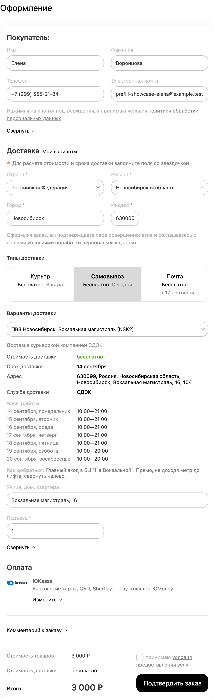
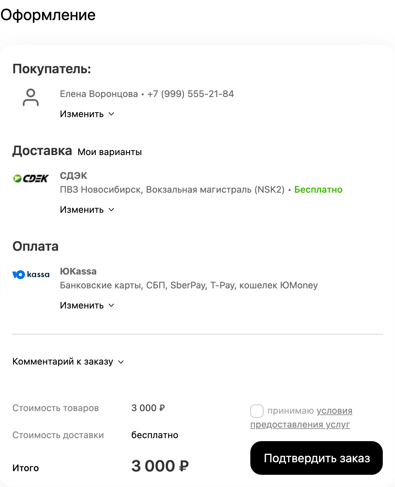
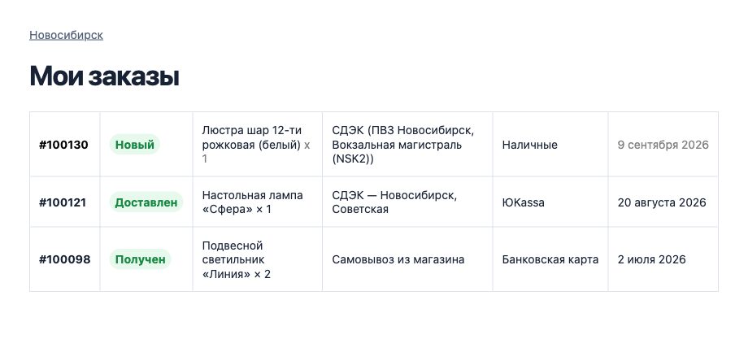
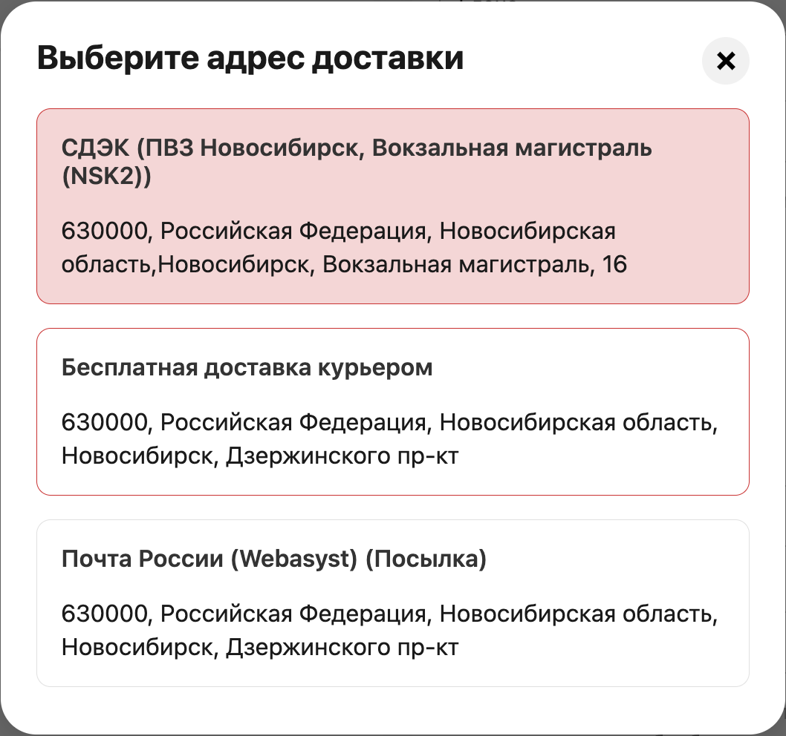

# Описание плагина для магазина Webasyst

Редакция для обсуждения, 07.09.2026. Публичное название ещё не выбрано; внутреннее имя в карточке не используется. В магазин переносится раздел «Текст карточки». Комментарии с местами изображений заменяются готовыми материалами.

## Текст карточки

### Короткое описание

Не теряйте покупателя в самый важный момент. Контакты, адрес, доставка и оплата уже в форме оформления заказа — привычный опыт покупки как на маркетплейсах.

<!-- Готовый HTML-фрагмент карточки со стилями и скриншотами: previews/store-description-preview.html. Файл содержит только описание, без имитации интерфейса магазина. -->

### Три результата для вашего магазина

#### Больше завершённых повторных заказов

Плагин убирает повторный ввод контактов, адреса, доставки и оплаты. Покупателю остаётся проверить данные и нажать «Оформить заказ». В [материале Google Chrome от 20 декабря 2024 года](https://blog.google/products-and-platforms/products/chrome/chrome-autofill/) конверсия гостевого оформления заказа в тестах Shopify была на **45% выше** с автозаполнением.

#### Быстрее и удобнее с телефона

Дзен-режим превращает длинную форму оформления заказа в компактную сводку. Меньше прокрутки, ручного ввода и случайных ошибок. В исследовании Chrome 2024 года использовались агрегированные данные согласившихся пользователей на тысячах популярных сайтов США: с автозаполнением оформление занимало в среднем на **35% меньше времени**.

#### Сервис как на маркетплейсах

Магазин помнит постоянного покупателя, его привычный адрес и способ доставки. Всё уже подготовлено, но любые данные можно изменить — знакомый сценарий покупки как на Ozon и Wildberries.

*45% и 35% — результаты исследования Chrome и тестов Shopify, опубликованные Google в 2024 году, а не гарантированный прирост от установки плагина. Фактический результат зависит от магазина, аудитории и настроек оформления заказа.*

### Повторные покупки — как на маркетплейсах

Сделайте повторный заказ таким же привычным, как покупка на Ozon или Wildberries: данные уже указаны, доставку не нужно выбирать заново.

Плагин подставляет контакты, адрес, доставку и способ оплаты из предыдущего заказа. Если всё по-прежнему, покупателю остаётся проверить данные и нажать «Оформить заказ».

Меньше повторного ввода — проще завершить покупку. Это помогает повысить конверсию повторных заказов, особенно когда клиент покупает с телефона.

*Контакты подставлены — покупатель переходит к проверке заказа, а не к повторному заполнению полей.*

### На экране — только главное

Дзен-режим собирает данные покупателя, доставку и оплату в компактные карточки. Адрес, способ доставки и оплаты остаются перед глазами, а заполненные поля не занимают экран. Изменить данные можно кнопкой «Изменить».

Оформление подстраивается под тему магазина: можно задать отдельные акцентные цвета для светлого и тёмного режима, выбрать размер и источник иконок, использовать аватар покупателя или логотипы способов доставки и оплаты. Тексты сводок меняются через шаблоны с переменными и условиями; для отдельных способов доставки и оплаты доступны персональные шаблоны. CSS-классы кнопок и собственные CSS-переопределения позволяют точнее вписать элементы в тему дизайна.

*Всё нужное видно на одном экране: покупатель, доставка, оплата и кнопка подтверждения заказа.*

### Постоянная авторизация

#### Когда бы покупатель ни вернулся, он уже авторизован

Плагин может сохранить авторизацию после оформления заказа. При следующем визите покупателю не нужно снова входить в аккаунт: история заказов доступна, а оформление уже заполнено.

Функция включается в настройках и работает, когда авторизация покупателей и «Запомнить меня» разрешены в Shop-Script.

### Домой, в офис или в привычный пункт выдачи

В разделе «Мои варианты доставки» покупатель выбирает адрес и доставку из прошлых заказов. Не нужно снова вводить улицу и номер дома или искать тот же пункт на карте. Выбор вариантов доступен после входа в аккаунт магазина.

*Адрес и способ доставки — без повторного ввода.*

### Что ещё умеет плагин

- **Помнит гостевые покупки.** При следующем визите в том же браузере данные можно подставить и без аккаунта. По умолчанию сохранение требует согласия покупателя.
- **Не перезаписывает ручной ввод.** Изменённые или удалённые покупателем данные важнее истории и не возвращаются обратно.
- **Интегрируется с другими плагинами.** Передаёт город последнего заказа в CitySelect, «SEO-регионы» и «Доставку и платежи» вместо неточного определения по IP.
- **Сохраняет важные детали в сводке.** Дзен-режим может показывать сроки, адрес и расписание пункта выдачи, фотографии, описание доставки, комментарий и дополнительные поля.
- **Гибкая система шаблонов.** Для конкретных способов доставки и оплаты можно настроить свои сводки и проверить их в предпросмотре.
- **Позволяет выбрать разделы.** Отдельно включается заполнение данных покупателя, доставки, оплаты и подтверждения заказа.
- **Проверяет прежнюю доставку.** Если сохранённый вариант больше не подходит текущему заказу, покупатель получает понятное предложение выбрать другой.
- **Настраивается по витринам.** Функции, тексты, шаблоны, иконки, цвета и CSS можно задавать отдельно для разных витрин магазина.

### Перед установкой

Shop-Script 10.0+, PHP 7.4+, интерфейс Webasyst 2.0. Плагин работает со стандартным оформлением заказа Shop-Script. После установки всё настраивается в привычной админке; изменять шаблоны темы не требуется. Плагин подключается только на странице оформления заказа и не затрагивает каталог. Если данных не хватает или прежняя доставка недоступна, покупатель дополняет форму либо выбирает другой сохранённый вариант.

### В планах

- **Ещё короче путь к покупке:** заказ в один клик со страницы товара и более ранняя подготовка данных постоянного покупателя до перехода в корзину.
- **Доставка до открытия корзины:** выбор пункта выдачи в любом месте сайта, пожелания «Оставить у двери» и «Позвонить перед доставкой», вариант оплаты после получения.
- **Больше интеграций и подсказок:** связь с фильтрами доставки и оплаты, расширенная синхронизация города между витринами и полезные бейджи в свёрнутых разделах.

Это направления развития, а не функции текущей версии. Состав и порядок реализации могут измениться.

---

## Иллюстрации

В самом начале карточки, сразу после короткого описания, размещается адаптивная HTML-инфографика из трёх простых блоков. Рабочая версия находится в `previews/store-description-preview.html`:

1. **Больше завершённых заказов** — крупно «+45% в тестах Shopify», рядом готовое оформление заказа и кнопка подтверждения.
2. **Быстрее оформление** — крупно «−35% времени по данным Google», рядом оформление заказа, превращённое в компактную сводку.
3. **Как на маркетплейсах** — сохранённые адрес и доставка, отметка «Уже заполнено».

Первый экран собран как цельная инфографика: обещание результата слева и реальный скрин Дзен-режима справа. Основные цвета взяты с сайта Appark: `#2F55D4`, `#212529`, `#8492A6` и `#2ECA8B`. Фоны, текст и границы используют переменные Webasyst UI 2, поэтому описание подстраивается под светлую и тёмную тему. Источники и пояснение о том, что проценты относятся к стороннему исследованию, остаются обычным HTML-текстом под карточками — так они читаемы и кликабельны.

По структуре ориентиром послужила свежая карточка Bodysite «Ozon Доставка»: изолированные стили, сильный первый экран, адаптивные смысловые блоки и короткие подписи к визуальным примерам. Интерфейс и тексты не копируются; используется только удачный принцип подачи.

Растровый вариант `benefits-infographic-light-v1.png` сохранён как ранний концепт, но в итоговой карточке не используется.

Три скриншота интерфейса находятся в `docs/../screenshots/current/` и уже встроены в текст выше. HTML кадрирует нужную часть каждого снимка, показывает её на одинаковом по размеру холсте и добавляет лёгкую перспективу. Благодаря этому в кадре остаётся только демонстрируемая функция, но сам интерфейс не перерисовывается. Ozon и Wildberries упоминаются только как знакомый покупателю сценарий, без их интерфейсов и логотипов.

## Почему описание построено так — редакторская справка

Эту часть не публиковать в карточке.

- **Количество полей важнее числа шагов.** В исследовании оформления заказа Baymard основная нагрузка связана с полями, которыми покупатель должен управлять. Поэтому акцент — на готовых данных и свёрнутой форме. Это обоснование направления работы, а не измерение конверсии нашего плагина. [Baymard, 2024](https://baymard.com/blog/checkout-flow-average-form-fields).
- **Зарубежные данные подтверждают направление.** В исследовании Google пользователи с автозаполнением тратили на форму в среднем на 35% меньше времени, а в тестах Shopify гостевые оформления с автозаполнением завершались на 45% чаще. Цифры приводятся только с указанием контекста и не приписываются плагину. [Google Chrome, 2024](https://blog.google/products-and-platforms/products/chrome/chrome-autofill/).
- **Короткий и конкретный текст легче просматривать.** Исследование NN/g сравнивало лаконичность, структуру и нейтральный язык. Убраны повторные списки выгод и общие похвалы продукту. Результаты исследования относятся к удобству использования страницы, не к приросту продаж. [NN/g, 1997](https://www.nngroup.com/articles/concise-scannable-and-objective-how-to-write-for-the-web/).
- **Ключевая возможность плюс изображение.** В тестах товарных страниц Baymard такая подача помогала людям изучать свойства продукта. Для этой карточки выбраны три возможности; настройки занимают короткий абзац. Это применение результатов исследования к программному продукту, а не проверенный эксперимент с нашей страницей. [Baymard, 2018](https://baymard.com/blog/structure-descriptions-by-highlights).
- **Три аргумента — осознанный предел.** В экспериментах с продающими сообщениями положительное впечатление достигало максимума на трёх утверждениях, а четвёртое и последующие усиливали скептицизм. [Journal of Marketing, 2014](https://journals.sagepub.com/doi/10.1509/jm.11.0504).
- **Подписи объясняют, на что смотреть.** На каждом снимке одна короткая мысль, прямо связанная с показанным интерфейсом. [Baymard: пояснения на изображениях товара](https://baymard.com/blog/product-images-descriptive-text).

Формулировка «помогает повысить конверсию» описывает ожидаемую пользу сокращения повторного ввода. Проценты приводятся только как результаты явно названных сторонних исследований; собственный прирост плагину не обещается. Идентичность Ozon/Wildberries не заявляется. Будущие функции обозначены как планы без сроков.
