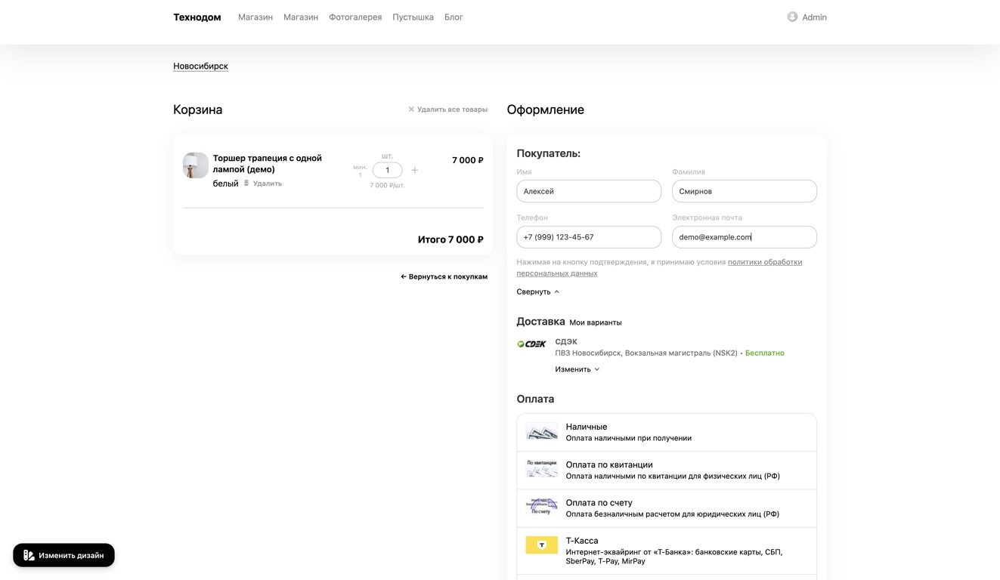
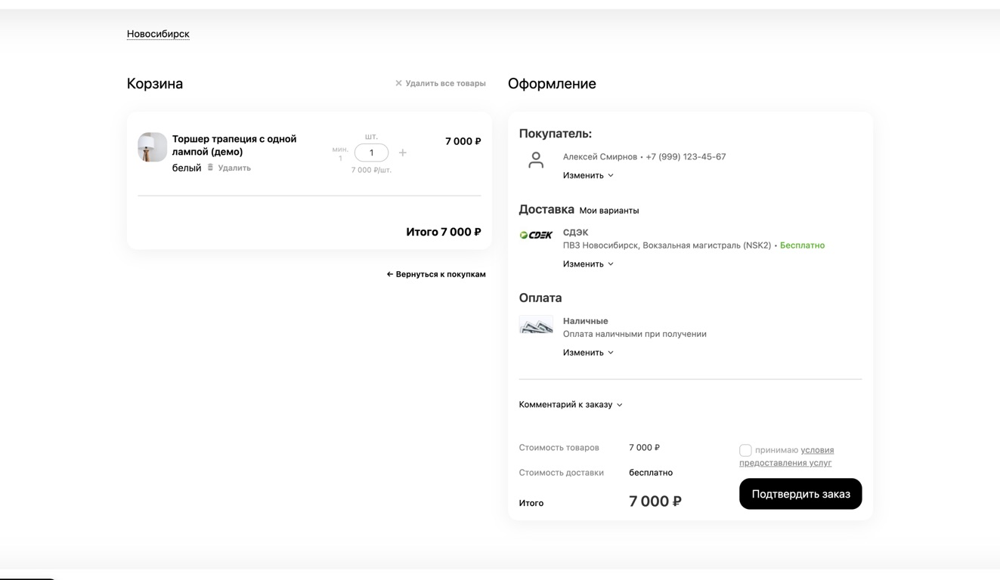
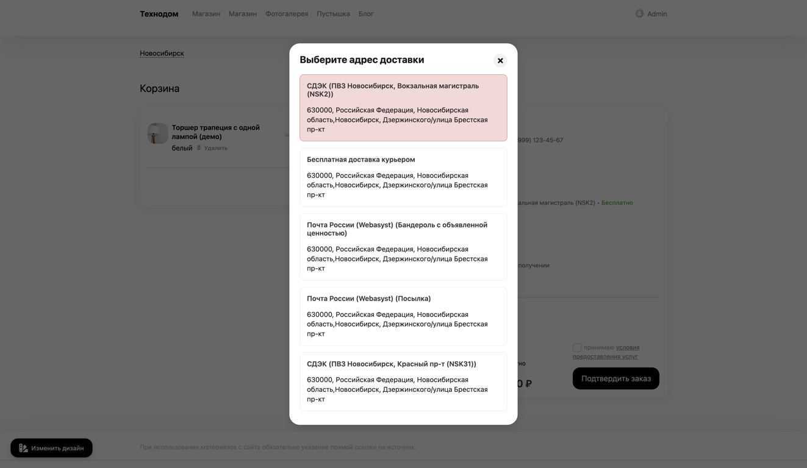

# Описание плагина для магазина Webasyst

Редакция для обсуждения, 07.09.2026. Публичное название ещё не выбрано; внутреннее имя в карточке не используется. В магазин переносится раздел «Текст карточки». Комментарии с местами изображений заменяются готовыми материалами.

## Текст карточки

### Короткое описание

Данные заказа уже заполнены, на экране — только главное. Привычное оформление как на маркетплейсах, в вашем магазине.

### Повторные покупки — как на маркетплейсах

Сделайте повторный заказ таким же привычным, как покупка на Ozon или Wildberries: данные уже указаны, доставку не нужно выбирать заново.

Плагин подставляет контакты, адрес, доставку и способ оплаты из предыдущего заказа. Если всё по-прежнему, покупателю остаётся проверить данные и нажать «Оформить заказ».

Меньше повторного ввода — проще завершить покупку. Это помогает повысить конверсию повторных заказов, особенно когда клиент покупает с телефона.

*Контакты подставлены — покупатель переходит к проверке заказа, а не к повторному заполнению полей.*

### Заполнено — можно свернуть

Дзен-режим собирает данные покупателя, доставку и оплату в компактные карточки. Адрес, способ доставки и оплаты остаются перед глазами, а заполненные поля не занимают экран. Изменить данные можно кнопкой «Изменить».

*Всё нужное видно на одном экране: покупатель, доставка, оплата и кнопка подтверждения заказа.*

### Домой, в офис или в привычный пункт выдачи

В разделе «Мои варианты доставки» покупатель выбирает адрес и доставку из прошлых заказов. Не нужно снова вводить улицу и номер дома или искать тот же пункт на карте. Выбор вариантов доступен после входа в аккаунт магазина.

*Адрес и способ доставки — без повторного ввода.*

### Работает и без регистрации

Гостевые покупки тоже можно запоминать: при следующем визите в том же браузере данные подставятся в форму. Функция включается в настройках; по умолчанию для неё требуется согласие покупателя.

### Настройте под свой магазин

Выбирайте, какие разделы заполнять и сворачивать, меняйте текст карточек, иконки и цвета. Для каждой витрины можно задать свои настройки.

Дополнительно: восстановление комментария и дополнительных полей доставки и оплаты; интеграции с CitySelect и «SEO-регионами» для передачи города из прошлого заказа.

### Перед установкой

Shop-Script 10.0+, PHP 7.4+, интерфейс Webasyst 2.0. Плагин рассчитан на стандартную форму оформления заказа Shop-Script. Автозаполнение использует сохранённые данные; если их не хватает или прежняя доставка недоступна, покупатель дополняет форму.

### В планах

Покупка со страницы товара в один клик, выбор пункта выдачи до перехода в корзину и пожелания к доставке — например, «Оставить у двери». Эти функции пока не входят в плагин.

---

## Иллюстрации

Три изображения находятся в `docs/assets/store/` и уже встроены в текст выше. В них показан собственный магазин; Ozon и Wildberries упоминаются только как знакомый покупателю сценарий, без их интерфейсов и логотипов.

## Почему описание построено так — редакторская справка

Эту часть не публиковать в карточке.

- **Количество полей важнее числа шагов.** В исследовании оформления заказа Baymard основная нагрузка связана с полями, которыми покупатель должен управлять. Поэтому акцент — на готовых данных и свёрнутой форме. Это обоснование направления работы, а не измерение конверсии нашего плагина. [Baymard, 2024](https://baymard.com/blog/checkout-flow-average-form-fields).
- **Короткий и конкретный текст легче просматривать.** Исследование NN/g сравнивало лаконичность, структуру и нейтральный язык. Убраны повторные списки выгод и общие похвалы продукту. Результаты исследования относятся к удобству использования страницы, не к приросту продаж. [NN/g, 1997](https://www.nngroup.com/articles/concise-scannable-and-objective-how-to-write-for-the-web/).
- **Ключевая возможность плюс изображение.** В тестах товарных страниц Baymard такая подача помогала людям изучать свойства продукта. Для этой карточки выбраны три возможности; настройки занимают короткий абзац. Это применение результатов исследования к программному продукту, а не проверенный эксперимент с нашей страницей. [Baymard, 2018](https://baymard.com/blog/structure-descriptions-by-highlights).
- **Подписи объясняют, на что смотреть.** На каждом снимке одна короткая мысль, прямо связанная с показанным интерфейсом. [Baymard: пояснения на изображениях товара](https://baymard.com/blog/product-images-descriptive-text).

Формулировка «помогает повысить конверсию» описывает ожидаемую пользу сокращения повторного ввода. Проценты роста, гарантированное число кликов и обещание идентичности Ozon/Wildberries не используются. Будущие функции обозначены как планы без сроков.
